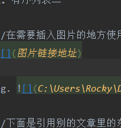

# 一级标题
## 二级标题
### 三级标题
#### 四级标题
##### 五级标题

- 无序列表一
- 无序列表二
1. 有序列表一
2. 有序列表二

//在需要插入图片的地方使用如下方式：




//下面是引用别的文章里的东西
> this is a ref

//粗体

**这个文字是粗体**

//斜体

*这个文字是斜体*

//代码引用

`hello world`

//多段代码引用

```
hello c
hello java
```