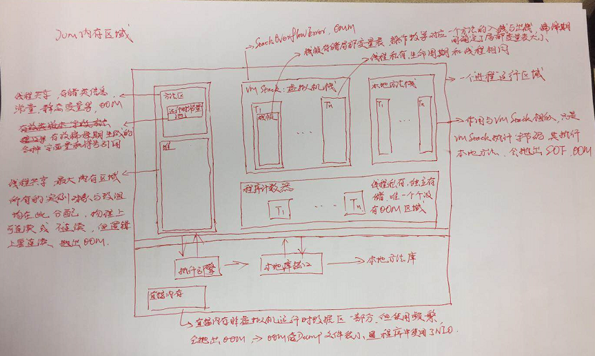
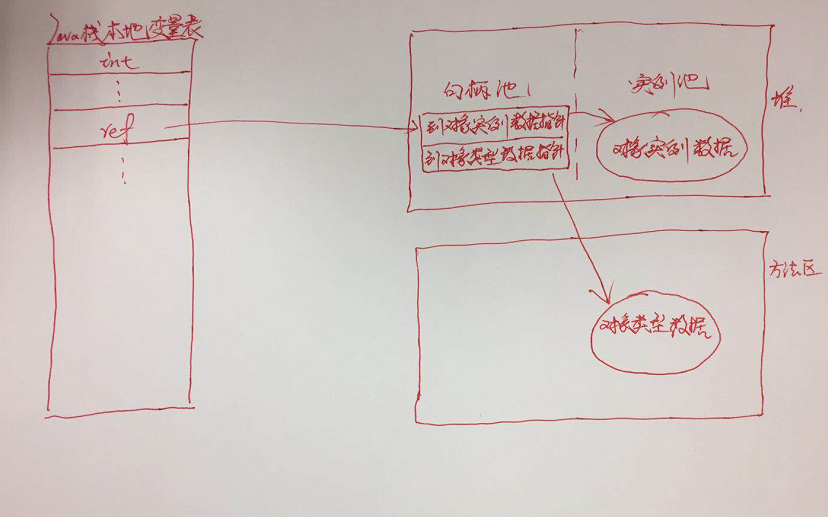
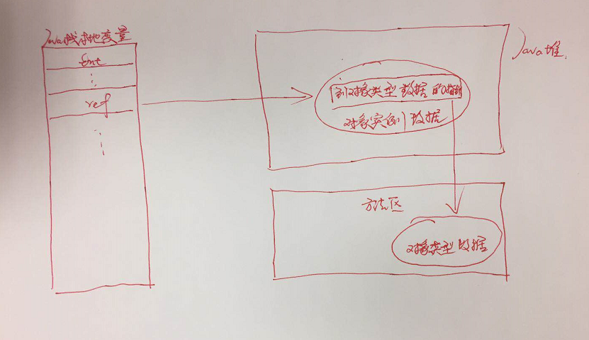

# JVM运行时内存布局
一个Java进行启动后，物理机器上会运行一个JVM虚拟机进程用来执行该程序。其运行时内存分布如下图：

# 对象的创建、对象内存布局、对象访问定位
1. 对象的创建
    - 当JVM遇到一个new指令时，首先去检查该指令的参数是否能在常量池中定位到一个类符号引用，并且检查这个符号引用代表的类是否已经加载、解析和初始化过。如果没有则执行相应的类加载过程，如果已经加载则为对象在堆内存上分配空间。
    
    - 一个对象所需要的内存大小在类加载完成后即已经确定。
    
    - 如果堆内存是绝对规整的，则采用指针碰撞分配内存，如果不规整则根据空闲列表进行分配内存。具体选择哪种分配方式则由Java堆是否规整决定，而Java堆是否规整又由所采用的垃圾收集器是否带有压缩整理的功能决定。
    
    - 因此对于使用Serial、ParNew等带Compact过程的收集器时，通常采用分配算法为指针碰撞，而使用CMS这种基于Mark-Sweep算法收集器时，采用算法为空闲列表。
    
    - 对象创建在虚拟机中是非常频繁的行为，即使是仅仅修改一个指针的指向位置，在并发情况下也不是线程安全的，为了解决这个问题一般有两种方案：一种是对分配内存空间的动作进行同步处理，实际上虚拟机采用的是CAS分配重试方式来保证更新操作的原子性。另外一种是把内存分配动作按照线程划分不同空间中进行，即每个线程在Java堆中预先分配一小块内存，成为本地线程分配缓存(TLAB)。只有当TLAB用完并分配新的TLAB时才需要进行同步锁定。虚拟机是否启动TLAB是通过-XX:+/-UseTLAB参数来设定
    
    - 内存分配完成后，虚拟机会对分配到的内存空间进行初始化为零值(不包括对象头)，如果启用了TLAB则此初始化会提前到TLAB阶段。
    
    - 然后虚拟机对该对象的对象头进行必要的设置，如：对象哈希码，GC分代年龄等。
    
    - 至此对于JVM来说对象已经创建完成，但是对于程序来说对象创建才刚刚开始，然后执行<init>方法，根据程序员意愿对该对象进行初始化。
    
2. 对象内存布局
    - 对象在内存中存储可以分为三块区域：对象头、实例数据和对齐填充。
    
    - 对象头分为两部分信息    第一部分：用于存储对象自身的运行时数据，如：哈希码、GC分代年龄、锁状态标志等。    第二部分：是类型指针，即对象指向其元数据的指针。虚拟机通过该指针来确定这个对象是哪个类的实例。
    
    - 实例数据是对象真正存储的有效信息，也是程序代码中所定义的各种类型的字段内容。无论是父类继承下来的，还是在子类中定义的，都需要记录起来。
    
    - 对齐填充并不是必然存在的，也没有特别的含义，仅仅是起占位符作用。因为JVM内存管理要求对象起始地址必须是8字节的整数倍，且对象头整好是8字节的一倍或者二倍。因此如果对象数据部分没有对齐时，就需要对齐填充来补全。
    
    
3. 对象访问定位
    为了使用对象，Java栈会存在一个引用指向堆中的实例对象。目前主要有两种访问方式：使用句柄和字节指针
    - 应用句柄原理如下图--此种访问方式最大的优势是对象被移动时，只会改变句柄中的实例数据指针，而ref本身不会修改
    
    
    - 直接指针原理如下图--此种方式是节省一次指针定位时间开销
    
    