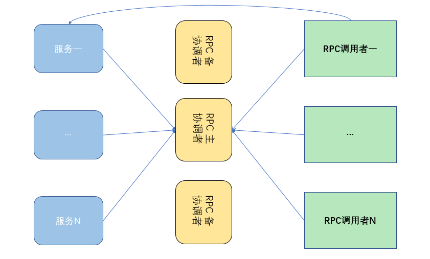

# AKKA
## 一、Akka简介
Akka 是一个用 Scala 编写的库，用于简化编写容错的、高可伸缩性的 Java 和 Scala 的 Actor 模型应用。
## 二、Akka特性
1. 易于构建并行和分布式应用(Simple Concurrency & Distribution) Akka在设计时采用了异步通讯和分布式架构，并对上层进行抽象，如Actors、Futures ，STM等。

2. 可靠性(Resilient by Design) 系统具备自愈能力，在本地/远程都有监护。

3. 高性能(High Performance) 在单机中每秒可发送50000000个消息。内存占用小，1GB内存中可保存2500000个actors。

4. 弹性，无中心(Elastic — Decentralized) 自适应的负责均衡，路由，分区，配置

5. 可扩展(Extensible) 可以使用Akka扩展包进行扩展。

## 三、Akka使用场景
任何需要高吞吐率和低延迟的系统都是使用Akka的候选。

## 四、通用RPC设计逻辑
通用的RPC框架见下图：

## 五、Akka Actor事件模型

## 六、