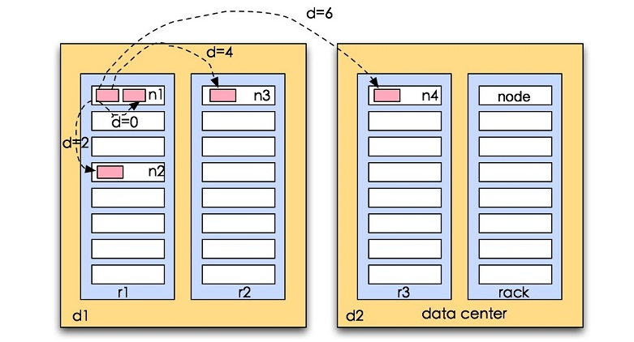

# 背景
  分布式的集群通常包含非常多的机器，由于受到机架槽位和交换机网口的限制，通常大型的分布式集群都会跨好几个机架，由多个机架上的机器共同组成一个分布式集群。机架内的机器之间的网络速度通常都会高于跨机架机器之间的网络速度，并且机架之间机器的网络通信通常受到上层交换机间网络带宽的限制。
  
# Hadoop网络拓扑距离
在大数据的情景中，带宽是稀缺资源，如何充分利用带宽，完美的计算代价开销以及限制因素都太多。Hadoop中对网络拓扑进行了规定：
- distance(d1/r1/n1,d1/r1/n1)=0 （相同节点）
- distance(d1/r1/n1,d1/r1/n2)=2 （相同机架不同节点）
- distance(d1/r1/n1,d1/r2/n3)=4 （相同数据中心不同机架）
- distance(d1/r1/n1,d2/r3/n4)=6 （不同数据中心）

图解：


# hadoop 副本放置策略
Hadoop集群，由于hadoop的HDFS对数据文件的分布式存放是按照分块block存储，每个block会有多个副本(默认为3)，并且为了数据的安全和高效，所以hadoop默认对3个副本的存放策略为：

第一个block副本放在和client所在的node里（如果client不在集群范围内，则这第一个node是随机选取的）
第二个副本放置在与第一个节点不同的机架中的node中（随机选择）
第三个副本似乎放置在与第二个副本所在节点同一机架的另一个节点上

# 机架感知配置
1. 启用机架感知
 默认情况下，hadoop的机架感知是没有被启用的。 要将hadoop机架感知的功能启用，配置非常简单，在namenode所在机器的hadoop-site.xml配置文件中配置一个选项：
 ````
 <property>
   <name>topology.script.file.name</name>
   <value>/path/to/RackAware.py</value>
 </property
 ````
 这个配置选项的value指定为一个可执行程序，通常为一个脚本，该脚本接受一个参数，输出一个值。接受的参数通常为某台datanode机器的ip地址，而输出的值通常为该ip地址对应的datanode所在的rack，例如”/rack1”。Namenode启动时，会判断该配置选项是否为空，如果非空，则表示已经用机架感知的配置，此时namenode会根据配置寻找该脚本，并在接收到每一个datanode的heartbeat时，将该datanode的ip地址作为参数传给该脚本运行，并将得到的输出作为该datanode所属的机架，保存到内存的一个map中。
 
 2. 编写脚本
 ````
     #!/usr/bin/python  
     #-*-coding:UTF-8 -*-  
     import sys  
       
     rack = {"hadoopnode-176.tj":"rack1",  
             "hadoopnode-178.tj":"rack1",  
             "hadoopnode-179.tj":"rack1",  
             "hadoopnode-180.tj":"rack1",  
             "hadoopnode-186.tj":"rack2",  
             "hadoopnode-187.tj":"rack2",  
             "hadoopnode-188.tj":"rack2",  
             "hadoopnode-190.tj":"rack2",  
             "192.168.1.15":"rack1",  
             "192.168.1.17":"rack1",  
             "192.168.1.18":"rack1",  
             "192.168.1.19":"rack1",  
             "192.168.1.25":"rack2",  
             "192.168.1.26":"rack2",  
             "192.168.1.27":"rack2",  
             "192.168.1.29":"rack2",  
             }  
       
       
     if __name__=="__main__":  
         print "/" + rack.get(sys.argv[1],"rack0")  
 ````
 
3. 机架感知验证
 由于没有找到确切的文档说明 到底是主机名还是ip地址会被传入到脚本，所以在脚本中最好兼容主机名和ip地址，如果机房架构比较复杂的话，脚本可以返回如：/dc1/rack1 类似的字符串。
 执行命令：chmod +x RackAware.py
 重启namenode,如果配置成功，namenode启动日志中会输出：
 2011-12-21 14:28:44,495 INFO org.apache.hadoop.net.NetworkTopology: Adding a new node: /rack1/192.168.1.15:50010  