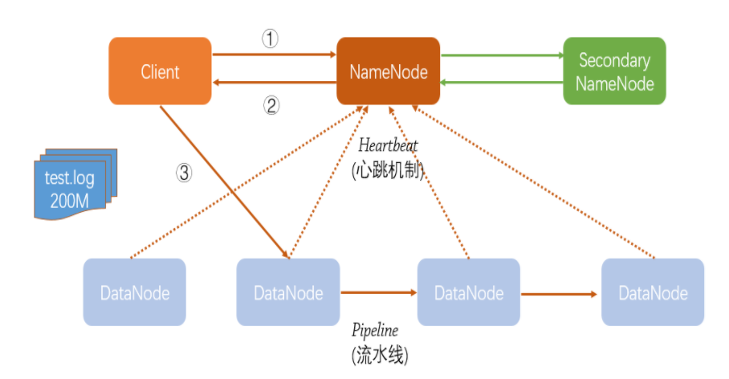
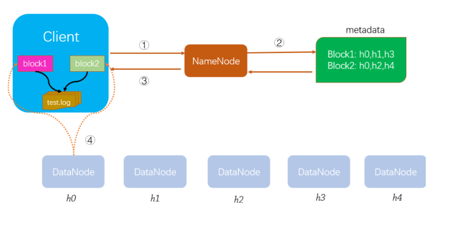

# 文件上传原理
- 流程图

- 流程描述
    假设客户端向hdfs集群上传一个200M的log文件
    1. 客户端根据文件大小进行分块
    2. 通过RPC调用向NN请求文件上传
    3. NN根据请求信息进行各种校验，返回对应的DN信息
    4. 客户端主动连接DN建立网络IO流进行上传
    5. DN根据副本数目和其他的DN建立pipeline通道
    6. 客户端先将数据写入到内部的数据队列然后以package方式写入DN
    7. DN先将package写入本机，然后通过pipeline写入其他的DN
    8. 只要一台DN写入成功后返回信息给客户端
    9. 客户端将该数据在校验队列数据移除
    10. 第一个数据块上传成功后，客户端会继续请求NN，重复上述步骤
    
# 文件下载原理
- 流程图

- 流程描述
    1. 客户端根据文件路径请求NN
    2. NN通过查询校验后返回请求文件对应的文件块所在的DN信息
    3. Client根据返回信息请求对应的DN节点
    4. 客户端和对应的DN建立网络IO用来接收数据和校验信息
    5. 待下载结束后会在对应的路径下查看到下载的文件和对应的校验文件
