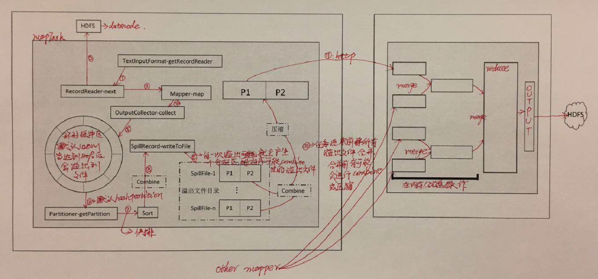

# shuffle与排序图解

# map端shuffle与排序

1. 根据用户设置或者默认文件输入格式类调用RecordReader读取文件
2. 将读取的K-V传递给自定义的map函数
3. map处理后将输出写入到环形内存缓冲区, 默认情况下内存缓冲区为100M，可以通过mapreduce.task.io.sort.mb属性设置内存大小，一旦内存使用超过该属性的默认的80%(可以通过属性mapreduce.map.sort.spill.percent设定)时会有一个后台线程将内存中数据溢出到磁盘,在溢出过程中map会继续往缓冲区里写数据，但是如果在此期间缓冲区满，则map会阻塞，直到写磁盘完成。溢出内容会写到mapreduce.cluster.local.dir属性指定的目录
4. 在写磁盘前，线程首先会根据数据分区规则进行分区
5. 分区结束后会对各个分区内从数据进行排序
6. 如果指定combine类，则有可能在溢出文件前会进行combine
7. 每一次达到溢出阈值都会溢出一个文件
8. 在任务完成之前会将所有的溢出文件进行分区、排序合并成一个文件
9. 如果指定了combine类，在合并前有可能会进行combine
10. 如果指定了map输出文件压缩(默认不压缩，可以通过mapreduce.map.output.compress mapreduce.map.output.compress.codec两个属性指定是否压缩和压缩库)，则会对map输出文件进行压缩

# reduce端shuffle与排序

1. reduce通过HTTP得到mapper的输出文件
2. 因为每个mapper任务完成时间不同，因此每个mapper完成时，reducer任务就开始复制该mapper对应的输出文件
3. reducer复制线程可以通过mapreduce.reduce.shuffle.parallelcopies属性指定，默认为五个
4. 如果mapper输出比较小，则输出会别复制到reduce任务的JVM内存中，否则被复制到内存
5. 待reduce复制完所有的mapper输出后会进入文件合并阶段
6. 合并后的文件是一个有序的大文件
7. reducer对每个键调用reduce函数
8. 然后OutputFormat调用RecordWriter.write方法将指定格式的文件输出到指定目录

# 优化配置
