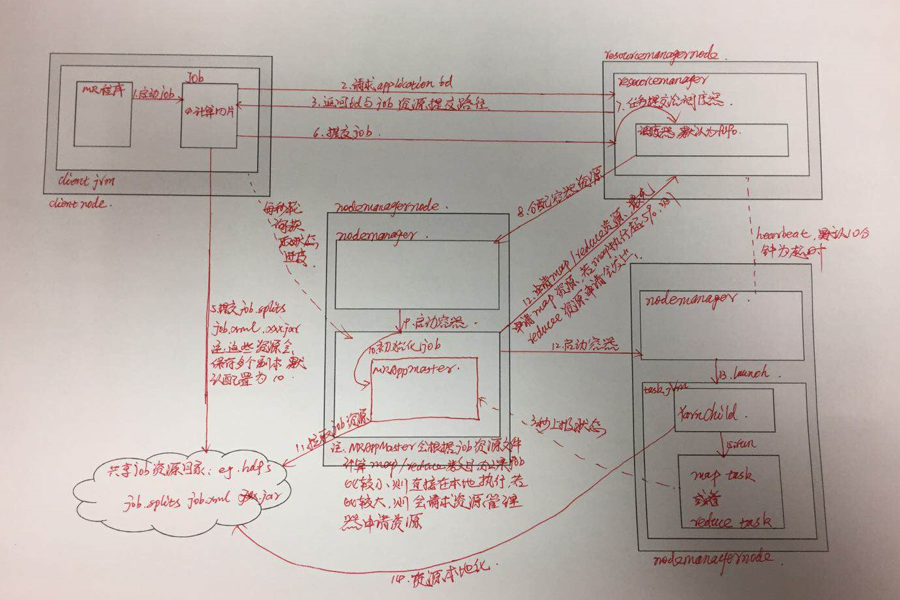

# mapreduce程序运行时实体
1. 客户端--提交mapreduce作业
2. resourcemanager--协调集群计算机资源的分配
3. nodemanager--启动和监视集群中计算机上的计算容器(container)
4. MRAppMaster--负责协调运行MR作业任务,与MR任务一样,均在容器中运行,这些容器由RM分配,由DM管理
5. 分布式文件系统--用于存储和共享作业资源文件,一般为HDFS

# mapreduce程序在yarn上运行流程
1. 作业提交 
	1. 客户端向资源管理器请求一个新的应用ID,用于MR作业ID
	2. 资源管理器向客户端返回ID和作业资源共享路径
	3. 客户端计算作业分片并将作业资源上传到共享路径下
		作业资源主要有job.splits job.xml xxx.jar
	4. 客户端调用资源管理器的submitApplication方法提交作业
2. 作业初始化
	1. 资源管理器收到作业提交请求后将该请求传递给YARN的调度器,调度器根据调用算法分配一个容器,然后资源管理器通知节点管理器分配容器并启动MRAppMaster
	2. MRAppMaster到共享资源路径下下载资源，并根据分片信息和reduce数量创建对应数目的map和reduce任务，并为每个任务分配ID
````
	默认情况下：少于10个mapper且只有一个reducer且输入大小小于一个HDFS文件块并认定为小作业，此条件可以通过mapreduce.job.ubertask.enable mapreduce.job.ubertask.maxmaps mapreduce.job.ubertask.maxreduces三个属性确定
````
3. 任务分配
	1. 如果作业不适合作为uber任务运行，MRAppMaster会向资源管理器为maptask和reducertask申请容器
	2. 该请求包含了内存需求和cpu数量，默认情况下每个任务分配1G内存和一个虚拟内核。资源请求由mapreduce.map.memory.mb mapreduce.map.cpu.vcores mapreduce.reduce.memory.mb mapreduce.reduce.cpu.vcores四个属性控制
	3. reduce任务可以在集群中任意节点运行，map任务由数据本地化的局限，YARN调度器会根据实际情况使得map任务尽可能在离数据最近的节点运行
	4. MRAppmaster会首先为map申请容器，当map任务至少执行5%以上后，才会为reduce任务发出请求容器申请
4. 任务执行
	1. 一旦资源管理器为任务在一个特定的节点上分配了容器，则MRAppMaster会和该节点的DM通信启动容器。该任务的主类为YARNChild，在其运行任务前会将任务资源本地化，然后运行map或reduce任务
	2. YARNChild在指定的JVM中运行，因此自定义的map reduce函数任何缺陷都不会影响到节点管理器
5. 进度状态更新
	1. 一个作业和它的每一个任务都有状态
	2. map任务进度是根据其处理输入占比来计算
	3. reduce任务进度包括复制、排序和reduce三个部分，即每个阶段各占任务的1/3,如果一个reduce部分完成了1/6，则其复制、排序阶段一定全部完成，对应整个reduce任务进度为5/6
	3. 任务每个三秒向MRAppMaster汇报状态和进度信息
	4. 客户端每隔一秒轮询MRAppMaster查询状态进度信息
6. 任务完成
	1. 当MRAppMaster收到最后一个任务完成的消息后，会将作业状态设置为成功
	2. 作业完成后，MRAppMaster和任务容器会清理其工作状态和删除工作目录

````
YARN:资源(cpu/memory)调度系统,使用cgroup实现资源分配与隔离
````
# 作业执行流程图解

