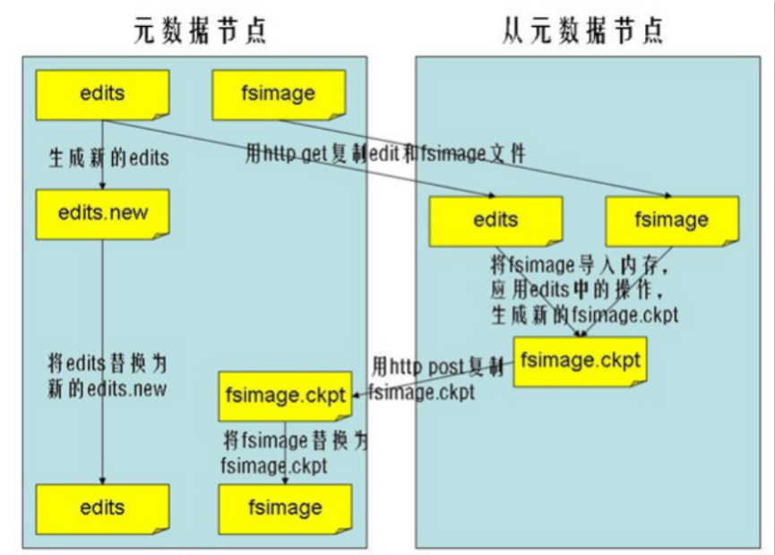

# namenode datanode secondarynamenode节点功能

- namenode工作特点
    1. Namenode始终在内存中保存metedata，用于处理“读请求” 
    2. 到有“写请求”到来时，namenode会首先写editlog到磁盘，即向edits文件中写日志，成功返回后，才会修改内存，并且向客户端返回
    3. Hadoop会维护一个fsimage文件，也就是namenode中metedata的镜像，但是fsimage不会随时与namenode内存中的metedata保持一致，而是每隔一段时间通过合并edits文件来更新内容。Secondary namenode就是用来合并fsimage和edits文件来更新NameNode的metedata的。
    
- datanode工作特点
    1. 提供真实文件数据的存储服务。
    2. 文件块（block）：最基本的存储单位。对于文件内容而言，一个文件的长度大小是size，那么从文件的０偏移开始，按照固定的大小，顺序对文件进行划分并编号，划分好的每一个块称一个Block。HDFS默认Block大小是128MB，以一个256MB文件，共有256/128=2个Block.dfs.block.size
    3. 不同于普通文件系统的是，HDFS中，如果一个文件小于一个数据块的大小，并不占用整个数据块存储空间
    4. Replication。多复本。默认是三个。hdfs-site.xml的dfs.replication属性
    
-secondarynamenode作用
    1.HA的一个解决方案。但不支持热备。配置即可。
    2.执行过程：从NameNode上下载元数据信息（fsimage,edits），然后把二者合并，生   成新的fsimage，在本地保存，并将其推送到NameNode，替换旧的fsimage.
    3.默认在安装在NameNode节点上，但这样...不安全！    
- secondarynamenode工作流程
    1. secondary通知namenode切换edits文件
    2. secondary从namenode获得fsimage和edits(通过http)
    3. secondary将fsimage载入内存，然后开始合并edits
    4. secondary将新的fsimage发回给namenode
    5. namenode用新的fsimage替换旧的fsimage

- checkpiont时机
  1. fs.checkpoint.period--指定两次checkpoint的最大时间间隔，默认3600秒。 
  2. fs.checkpoint.size--规定edits文件的最大值，一旦超过这个值则强制checkpoint，不管是否到达最大时间间隔。默认大小是64M。
  
- namenode与secondarynamenode交互图解

  

    